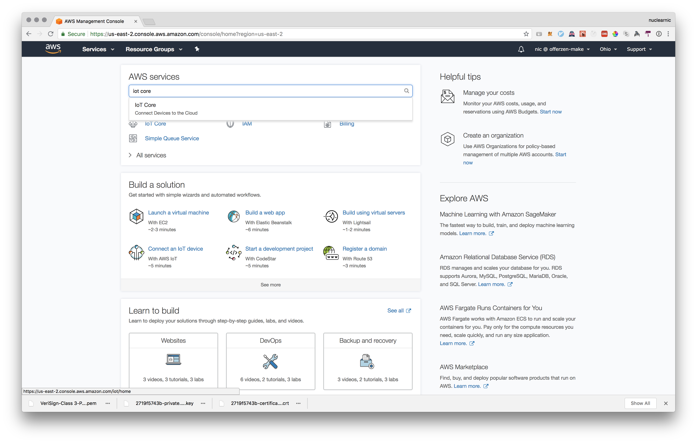
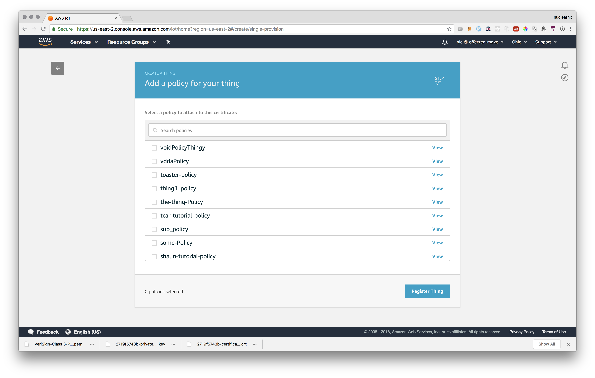

### Make: IoT Robots
# Register an IoT Device on AWS

## Outcome

In performing this activity, you'll __create a thing__ on AWS IoT Cloud, __create and attach a certificate__ to your thing, and __attach a policy__ to your thing's certificate.

## Activity

### Step 1: Sign into AWS IoT Cloud with your maker account.

Sign in page: https://offerzen-make.signin.aws.amazon.com/console Credentials: These have been mailed to you.

After logging in, <b>ensure that you are in the Ohio region</b>. There's a region-select dropdown next to your name in the top right of the page.

### Step 2: Navigate to the IoT Cloud's dashboard page.

1. Search for the Iot-Core service in the search bar and select that to navigate to the IoT-Core service.

2. There is a tutorial that you can follow and documentation to explore, so feel free to do so if you wish.

### Step 3: Create a Thing

1. Click on "Manage" and then "Things" in the sidebar. This will show you a list of things that have previously been created. Next click on the "Create" button.

2. Click on "Create a single thing".

3. Name your thing. There are several extra options here that we're not going to use right now. A thing can be given a <i>type</i>, added to a <i>group</i>, and given <i>attributes</i>. For now, just scroll to the bottom and click "Next".

### Step 4: Create a Certificate and attach it to your Thing

1. Click on "Create certificate".

2. Next we'll download all the files required for connecting to AWS-IoT. There are <b>three</b> files you need:
a) The <b>certificate</b> (cert.pem file).
b) The <b>private key</b> (private.key file).
c) The <b>root CA</b>. For this you have to right click on "Download", click "save link as", and then save it as in the screenshot below.

3. Activate your certificate by clicking on "Activate". Don't forget this step! You can now continue by clicking on "Attach a policy".

### Step 5: Attach a Policy to your Certificate

1. Now you'll see a list of policies that can be attached to our thing's certificate.

2. We've created a policy called <b>maker-policy</b> that has all the required permissions for this exercise. Search for it, select it, and click on "Register Thing".

That's it! You've created a thing, created a certificate and attached it to your thing, and attached a policy to your thing.

If you're interested in how the policy has been set up, you can click on "Secure", then "Policies", and search for maker-policy to have a look at the policy document.

### Stuck?

_If you need help, contact [@nuclearnic](https://offerzen-make.slack.com/messages/DA5HF1659) on Slack._

<!-- ## Extra resources -->
